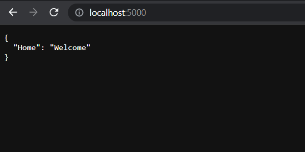

# WorldTour
[](https://app.circleci.com/pipelines/github/Ineslzr/WorldTour) [](https://sonarcloud.io/dashboard?id=Ineslzr_WorldTour) [](https://sonarcloud.io/summary/new_code?id=Ineslzr_WorldTour) [](https://codecov.io/gh/Ineslzr/WorldTour) [](https://www.gnu.org/licenses/gpl-3.0)

## Prérequis

Avoir installé Python, NodeJS, pip et MAMP, Wamp ou XAMPP

## Installation
Récupérez le code source de l'application en utilisant la commande **git clone** ci-dessous ou en téléchargeant le zip.

```cmd
git clone git@github.com:Ineslzr/WorldTour.git
```

Si vous ne parvenez pas à cloner le projet, vérifiez que vous avez bien généré votre clef ssh.

## Installation de la base de données

1. Lancez Mamp, Wamp ou Xampp et ouvrez PhpMyAdmin.

2. Dans l'onglet **Comptes utilisateurs**, créez un utilisateur "root" avec comme mot de passe "root" (s'il n'existe pas déjà).

3. Créez une base de données **worldtour** et y importer le fichier **wordltour.sql** trouvable dans le dossier **docs**. Vous devriez voir ensuite toutes les tables.

## Lancement du backend

Effectuez les commandes suivantes dans un terminale :

```cmd
cd backend\api
```

Activez l'environnement

```cmd
.\venv\Scripts\activate
```

Lancez le back

```cmd
cd ..
python run.py
```

Ouvrez ensuite un navigateur et taper l'URL suivante : **http://localhost:5000**

Vous devriez voir :




## Lancement du frontend

Ouvrez un second terminal et tapez ces 2 commandes :

```cmd
cd web
npm start
```

Si tout se passe bien, le navigateur devrait s'ouvrir de lui-même.


## Lancement automatique du backend et du frontend

Dans le dossier source "WorldTour", ouvrez un terminal et tapez cette commande :

``` ./back_launch.bat```

Si tout se passe bien, le navigateur devrait s'ouvrir tout seul.


**Et voilà ! L'application devrait être lancée.**

